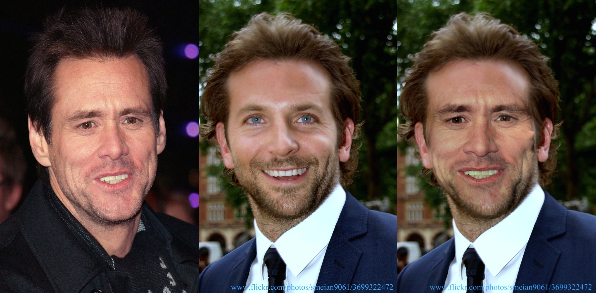

# Face swap Using Landmarks

## Project structure
This project is divided into 2 main parts. 

- The first part extracts landmarks from the face image using mediapipe facemesh solution.
- The 2nd part swaps the 2 faces by replacing corresponding triangular part of the 2 faces using Delaunav Triangulation methods.
  
## Prepare environment for demo

Clone the repo:

`git clone https://github.com/trinanjan12/skunkworks_projects`

Install the requirements:
 
`cd face_landmarks/face_swap_library`
`source setup_env.sh`

Running the demo for faceswap between 2 images:

`python face_swap_images.py`

This will show the swapped face by taking 2 default images.
You can provide the source and target images using arguments.
For example 
`python face_swap_images.py --source ./images/jim_carrey.jpg --target ./images/bradley_cooper.jpg`

Running the demo for faceswap using webcam:

`python face_swap_video.py`
This will swap face from a default image to your face using the webcam output.

to provide a particular image use 

`python face_swap_video.py  --source ./images/jim_carrey.jpg`

## References :

This code heavily borrows from the following sources

- [Mediapipe](https://google.github.io/mediapipe/solutions/face_mesh)  
- [Face swap using opencv](https://pysource.com/2019/05/28/face-swapping-explained-in-8-steps-opencv-with-python/)

## Example Output:

